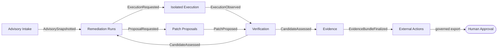

<div align="center">

# 🔥 Cauterizer

**Verifiable, human-gated remediation evidence for approved vulnerabilities — with hostile execution, patch generation, and deterministic verification kept strictly apart.**

[](https://github.com/nicholas-ruest/cauterizer/actions/workflows/ci.yml)
[](https://github.com/nicholas-ruest/cauterizer/actions/workflows/supply-chain.yml)
[](LICENSE)
[](rust-toolchain.toml)
[](Cargo.toml)
[](docs/adr/ADR-001-bound-the-mvp-to-an-offline-human-gated-loop.md)

</div>



<div align="center">

*A candidate patch never talks to the verifier. The verifier never talks back to the solver. Evidence is signed, immutable, and only a human can authorize an export.*

</div>

---

<details>
<summary><strong>📖 Table of Contents</strong></summary>

- [What Cauterizer Is](#-what-cauterizer-is)
- [What Cauterizer Deliberately Does Not Do](#-what-cauterizer-deliberately-does-not-do)
- [Architecture](#-architecture)
- [Repository Layout](#-repository-layout)
- [Getting Started](#-getting-started)
- [Development Workflow](#-development-workflow)
- [Security & Trust Model](#-security--trust-model)
- [Documentation Map](#-documentation-map)
- [Project Status](#-project-status)
- [Contributing](#-contributing)
- [License](#-license)

</details>

## 🎯 What Cauterizer Is

Cauterizer turns an **approved vulnerability advisory** into **independently verifiable remediation evidence**, without letting hostile execution, probabilistic patch generation, deterministic verification, signing, or external authority contaminate one another.

Given an approved public advisory and an immutable target revision, Cauterizer can:

- ingest and snapshot the advisory into an immutable, provenance-tracked record;
- reproduce the vulnerable behavior inside an isolated, resource-confined worker;
- obtain a bounded candidate patch from an explicitly limited solver view;
- independently grade the candidate against a hidden verifier oracle;
- produce a signed, in-toto-compatible evidence bundle binding inputs, process, and verdict;
- present a redacted result for a human to approve, dry-run, or export.

It is built as a Domain-Driven Design workspace of **11 bounded contexts**, governed by **24 accepted/proposed ADRs**, and enforced by a custom architecture-linting crate that fails CI on layering or context-boundary violations — not just on style.

<details>
<summary><strong>🧭 Ubiquitous language (click to expand)</strong></summary>

| Term | Meaning |
|---|---|
| **Advisory Snapshot** | Immutable normalized vulnerability information and source provenance at one instant |
| **Target Revision** | Immutable repository identity and commit selected for a run |
| **Remediation Run** | The aggregate coordinating one advisory–target–policy attempt |
| **Solver Brief** | The complete information and limits intentionally exposed to a solver |
| **Candidate Patch** | Immutable proposed diff plus generator provenance — never a fix by assertion |
| **Evaluation** | Verifier-owned facts about applying and testing one candidate |
| **Verdict** | Deterministic result: `VerifiedForFixture`, `Rejected`, `Inconclusive`, or `NonConformant` |
| **Evidence Bundle** | Verifiable statement binding exact artifacts, observations, policy, and verdict |
| **Approval Grant** | Human authorization scoped to a specific eligible evidence digest and action |

The words **safe**, **fixed**, **proof**, and **approved** are never used unqualified — every claim states its subject and scope (e.g. *"candidate is `VerifiedForFixture`"*, not *"fixed"*).

</details>

## 🚫 What Cauterizer Deliberately Does Not Do

Per [ADR-001](docs/adr/ADR-001-bound-the-mvp-to-an-offline-human-gated-loop.md), the current MVP boundary is an **offline-first, export-only, human-gated loop**. It intentionally will not:

- scan or exploit live targets;
- submit vulnerability reports or create external tickets automatically;
- merge patches, publish packages, release, or deploy;
- grant any agent the authority to execute an external mutation without a recorded human `Approval Grant`.

Extending any of the above is treated as a new architectural goal requiring its own threat model and a superseding ADR — never a silent capability creep.

## 🏗️ Architecture

<details>
<summary><strong>Bounded contexts</strong></summary>

| Subdomain | Type | Bounded Context | Purpose |
|---|---|---|---|
| Tenant governance | Platform | Organization & Access | Isolate organizations, identities, roles, and policy |
| Commercial operations | Commercial | Commercial Entitlements | Enforce plans, quotas, reservations, and usage |
| Customer scope | Supporting | Asset Portfolio | Own authorized targets, environments, and scope |
| Connector ecosystem | Platform | Integration Management | Govern connector installation, capabilities, and health |
| Vulnerability normalization | Supporting | Advisory Intake | Normalize and snapshot untrusted advisories |
| Remediation lifecycle | **Core** | Remediation Runs | Coordinate immutable, idempotent remediation state |
| Hostile workload containment | Supporting | Isolated Execution | Execute declared jobs without verdict authority |
| Candidate generation | Supporting | Patch Proposals | Produce bounded candidate patches |
| Independent patch assessment | **Core** | Verification | Produce narrowly scoped deterministic verdicts |
| Verifiable claims | **Core** | Evidence | Bind process, inputs, observations, and verdicts |
| Human-governed handoff | Supporting | External Actions | Authorize and export eligible outcomes |

Full detail: [DDD overview](docs/ddd/README.md) · [Context map](docs/ddd/context-map.md)

</details>

<details>
<summary><strong>Enforced architectural invariants</strong></summary>

A dedicated `architecture-tests` crate statically scans package manifests and source — without compiling product crates — and fails CI on:

- **Domain purity** — domain packages may not depend on database, network, web, queue, cloud, or runtime/framework crates;
- **Dependency direction** — domain cannot depend on application, infrastructure, contracts, or binaries;
- **Context ownership** — a package cannot depend on another bounded context's internal crate; only versioned contract packages may cross;
- **Acyclic workspace** — cycles among local packages fail regardless of layer;
- **No hidden source import** — source-level references to another context's internals fail even without a manifest dependency;
- **Canonical independence** — domain/contract source cannot reference upstream SDKs, cloud providers, or tooling markers directly;
- **Unsafe default** — `unsafe` code, blocks, and local suppressions are rejected workspace-wide (`unsafe_code = "forbid"`).

See [Architecture Rules](docs/development/architecture-rules.md).

</details>

<details>
<summary><strong>Information-flow guarantees</strong></summary>

- Patch Proposals **cannot** call Verification, or access verifier artifact stores, caches, logs, identities, or timing telemetry (the solver/verifier conformance firewall, [ADR-005](docs/adr/ADR-005-enforce-a-solver-grader-conformance-firewall.md)).
- Isolated Execution **cannot** access policy signing keys or approval capabilities.
- Evidence can read immutable published artifacts by digest but **cannot** alter their owning aggregates.
- External Actions **cannot** alter a verdict or bundle — any input change requires a new bundle.
- Every operation is tenant-scoped; there is no code path where tenant filtering exists only in the API layer.

</details>

## 📂 Repository Layout

```text
cauterizer/
├── crates/
│   ├── contexts/               # 11 bounded-context domain + application crates
│   ├── adapters/                # Infrastructure adapters (Postgres, OSV, artifact stores)
│   ├── cauterizer-api/           # Contract-first, idempotent HTTP surface
│   ├── cauterizer-cli/           # Local operator command-line interface
│   ├── cauterizer-contracts/     # Versioned, serialized public contract shapes
│   ├── cauterizer-infrastructure/# Shared infrastructure mechanisms
│   ├── cauterizer-syntax/        # Context-neutral syntax/mechanism primitives
│   ├── cauterizer-worker/        # Isolated execution worker
│   └── architecture-tests/       # CI-enforced dependency/layering gate
├── docs/
│   ├── adr/                      # 24 architecture decision records
│   ├── ddd/                      # Domain model, context map, per-context packages
│   ├── architecture/             # Threat model, data flow, production readiness
│   ├── development/              # Enforced architecture rules
│   └── reviews/                  # ADR/DDD compliance and drift reviews
├── schemas/                       # JSON Schemas for contracts, evidence, and events
└── scripts/
    ├── ci/                        # Release-gate and action-pin verification
    └── ops/                       # Backup/restore and rollback drills
```

## 🚀 Getting Started

<details open>
<summary><strong>Prerequisites</strong></summary>

- Rust **1.88.0** (pinned via [`rust-toolchain.toml`](rust-toolchain.toml), installed automatically by `cargo` if using `rustup`)
- PostgreSQL (for adapter/integration tests)

</details>

<details>
<summary><strong>Build</strong></summary>

```bash
cargo build --workspace --all-targets --all-features --locked
```

</details>

<details>
<summary><strong>Test</strong></summary>

```bash
# Unit + integration tests
cargo test --workspace --all-targets --all-features --locked

# Doc tests
cargo test --workspace --all-features --doc --locked
```

Adapter/integration tests expect Postgres reachable via `CAUTERIZER_TEST_POSTGRES_URL` and `CAUTERIZER_TEST_ADAPTER_POSTGRES_URL` (see [`ci.yml`](.github/workflows/ci.yml) for the exact local setup used in CI).

</details>

<details>
<summary><strong>Run the CLI</strong></summary>

```bash
cargo run -p cauterizer-cli
```

</details>

## 🛠️ Development Workflow

```bash
cargo fmt --all -- --check
cargo clippy --workspace --all-targets --all-features --locked -- -D warnings
cargo test --workspace --all-targets --all-features --locked
```

Before opening a change:

1. Read the governing ADRs and the full DDD package for the bounded context you're touching.
2. Keep domain behavior inside its owning context; cross-context behavior goes through an application facade or a versioned contract.
3. Add tests for success, denial/failure, retries, tenant boundaries, classification/redaction, and compatibility.
4. Run formatting, Clippy (warnings denied), the full test suite, architecture tests, and dependency/license/advisory checks.

Full detail: [`CONTRIBUTING.md`](CONTRIBUTING.md)

## 🔐 Security & Trust Model

<details>
<summary><strong>Key guarantees</strong></summary>

- **Unsafe Rust is forbidden by default** workspace-wide; an exception requires a dedicated minimal crate, a written safety invariant/threat analysis, Miri/fuzzing, and named security-owner review.
- **Solver/verifier conformance firewall** — candidate generation never observes verifier internals, timing, or retry behavior ([ADR-005](docs/adr/ADR-005-enforce-a-solver-grader-conformance-firewall.md)).
- **Immutable, signed evidence** — evidence bundles are in-toto-compatible and bind exact artifacts, observations, policy, and verdict ([ADR-007](docs/adr/ADR-007-emit-in-toto-compatible-evidence-bundles.md)).
- **Tenant isolation & zero-trust authorization** enforced at the domain layer, not just presentation ([ADR-010](docs/adr/ADR-010-enforce-tenant-isolation-and-zero-trust-authorization.md)).
- **Classification, encryption, and redaction by policy** for all sensitive data ([ADR-011](docs/adr/ADR-011-classify-encrypt-redact-and-retain-data-by-policy.md)).
- **Supply-chain hardening** — pinned toolchain, `Cargo.lock` committed, SBOM generation, signed release artifacts and provenance, GitHub Actions pinned by commit SHA ([ADR-019](docs/adr/ADR-019-secure-the-software-supply-chain-and-release-process.md)).

</details>

<details>
<summary><strong>Reporting a vulnerability</strong></summary>

This project treats repositories, advisories, patches, builds, tests, fixtures, and model output as **untrusted input** by default. If you believe you've found a security issue in Cauterizer itself, please open a private security advisory on GitHub rather than a public issue.

</details>

## 📚 Documentation Map

| Resource | Description |
|---|---|
| [ADR Index](docs/adr/README.md) | All 24 architecture decision records |
| [DDD Overview](docs/ddd/README.md) | Domain vision, subdomains, ubiquitous language |
| [Context Map](docs/ddd/context-map.md) | Cross-context relationships and forbidden dependencies |
| [Architecture Rules](docs/development/architecture-rules.md) | CI-enforced layering and dependency invariants |
| [Production Readiness Blueprint](docs/architecture/production-readiness.md) | Deployable editions and production gates |
| [Security Threat Model](docs/architecture/security-threat-model.md) | Abuse cases and threat scaffold |
| [Decision Traceability](docs/architecture/decision-traceability.md) | Decision-to-delivery mapping |

## 📊 Project Status

Cauterizer is an **early-stage, offline-first MVP** (~40k lines of Rust across 23 workspace crates) built with a specification-first discipline: every bounded context is documented before it is implemented, and every implemented invariant is backed by an ADR and an enforced test.

- ✅ Domain model, application facades, and Postgres/OSV adapters for most contexts
- ✅ Architecture-boundary enforcement, CI quality gates, and supply-chain hardening wired in
- ✅ Contract-first API layer and content-addressed artifact storage
- 🚧 Hosted sandbox execution, KMS/HSM-backed signing, multi-zone SLO/DR drills, and hermetic fixture acquisition remain explicit, tracked placeholders pending named infrastructure and external approval — see [`production-readiness-track.md`](docs/architecture/production-readiness-track.md)

This project does not mark infrastructure it cannot provision as done. See [`docs/architecture/p12-p20-prompt-plan.md`](docs/architecture/p12-p20-prompt-plan.md) for the honest state of every remaining gap.

## 🤝 Contributing

Contributions are welcome — please read [`CONTRIBUTING.md`](CONTRIBUTING.md) first. This is a security-sensitive workspace: changes must preserve organization isolation, deterministic verification, immutable evidence, and the solver/verifier information-flow boundary. Findings must fail closed; never weaken a verdict, authorization rule, or conformance gate to make a test pass.

## 📄 License

Licensed under the [MIT License](LICENSE) © 2026 Nick Ruest.
