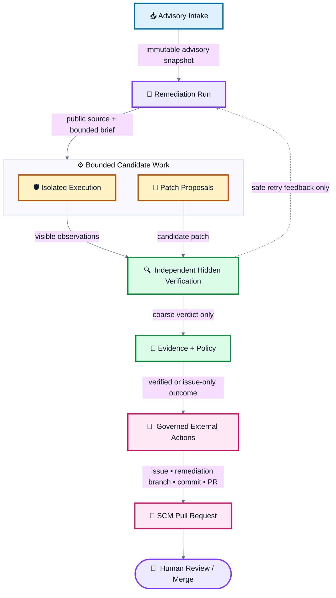

<div align="center">

# 🔥 Cauterizer

**Automated vulnerability remediation delivered as independently verified pull requests for human review.**

[](https://github.com/nicholas-ruest/cauterizer/actions/workflows/ci.yml)
[](https://github.com/nicholas-ruest/cauterizer/actions/workflows/supply-chain.yml)
[](LICENSE)
[](rust-toolchain.toml)
[](Cargo.toml)
[](docs/adr/ADR-025-automate-remediation-and-deliver-reviewable-pull-requests.md)

</div>



**At a glance:** advisory → bounded repair attempts → independent hidden
verification → evidence-backed issue/branch/commit/PR → human review. The dashed
line is the only retry path, and it carries sanitized visible feedback—not
hidden verifier details.

<div align="center">

*The agent may fix, test, and open a pull request. Hidden verification never becomes solver feedback, and only a human may merge.*

</div>

---

<details>
<summary><strong>📖 Table of Contents</strong></summary>

- [What Cauterizer Is](#-what-cauterizer-is)
- [What Cauterizer Deliberately Does Not Do](#-what-cauterizer-deliberately-does-not-do)
- [Ruvnet Projects and Prior Art](#-ruvnet-projects-and-prior-art)
- [Architecture](#-architecture)
- [Repository Layout](#-repository-layout)
- [Getting Started](#-getting-started)
- [Production Activation Requirements](#-production-activation-requirements)
- [Development Workflow](#-development-workflow)
- [Security & Trust Model](#-security--trust-model)
- [Documentation Map](#-documentation-map)
- [Project Status](#-project-status)
- [Contributing](#-contributing)
- [License](#-license)

</details>

## 🎯 What Cauterizer Is

Cauterizer turns an **approved vulnerability advisory** into an **independently verified remediation pull request**, without letting hostile execution, probabilistic patch generation, deterministic verification, signing, or external authority contaminate one another.

Given an approved public advisory and an immutable target revision, Cauterizer can:

- ingest and snapshot the advisory into an immutable, provenance-tracked record;
- reproduce the vulnerable behavior inside an isolated, resource-confined worker;
- iteratively obtain and repair bounded candidate patches using solver-visible build and test feedback;
- independently grade the candidate against a hidden verifier oracle;
- bind the candidate, run, verifier assessment, policy decision, and delivery measurements into immutable evidence records;
- create or update a deduplicated issue and remediation pull request for human review.

It is built as a Domain-Driven Design workspace of **11 bounded contexts**, governed by **25 proposed/superseded ADRs**, and enforced by a custom architecture-linting crate that fails CI on layering or context-boundary violations — not just on style.

<details>
<summary><strong>🧭 Ubiquitous language (click to expand)</strong></summary>

| Term | Meaning |
|---|---|
| **Advisory Snapshot** | Immutable normalized vulnerability information and source provenance at one instant |
| **Target Revision** | Immutable repository identity and commit selected for a run |
| **Remediation Run** | The aggregate coordinating one advisory–target–policy attempt |
| **Solver Brief** | The complete information and limits intentionally exposed to a solver |
| **Candidate Patch** | Immutable proposed diff plus generator provenance — never a fix by assertion |
| **Evaluation** | Verifier-owned facts about applying and testing one candidate |
| **Verdict** | Deterministic result: `VerifiedForFixture`, `Rejected`, `Inconclusive`, or `NonConformant` |
| **Evidence Bundle** | Verifiable statement binding exact artifacts, observations, policy, and verdict |
| **External Action Grant** | Installation-time, repository-scoped authority to create issues, remediation branches, commits, and pull requests |

The words **safe**, **fixed**, **proof**, and **approved** are never used unqualified — every claim states its subject and scope (e.g. *"candidate is `VerifiedForFixture`"*, not *"fixed"*).

</details>

## 🚫 What Cauterizer Deliberately Does Not Do

Per [ADR-025](docs/adr/ADR-025-automate-remediation-and-deliver-reviewable-pull-requests.md), the product boundary is **autonomous remediation with human-controlled integration**. It intentionally will not:

- scan or exploit live targets;
- merge or approve pull requests;
- push to protected/default branches or rewrite human-authored history;
- publish packages, create releases, deploy, or mutate production;
- expose connector credentials or hidden verifier feedback to a solver.

Extending any of the above is treated as a new architectural goal requiring its own threat model and a superseding ADR — never a silent capability creep.

## 🌊 Ruvnet Projects and Prior Art

<details>
<summary><strong>Projects, roles, and adapter boundaries</strong></summary>

Cauterizer was built with several Ruvnet projects as direct benchmark inputs,
design references, or replaceable adapter targets. We acknowledge them here so
their influence is visible and distinguishable from Cauterizer-owned code:

- [CVE-bench](https://github.com/ruvnet/CVE-bench) supplies the pinned
  reproduce-and-fix benchmark model and hidden-grader assumptions used by the
  Verification context. The repository records the fixture source and commit
  rather than treating benchmark results as proof of real-world vulnerability
  closure.
- [Ruflo](https://github.com/ruvnet/ruflo) informed the multi-agent swarm and
  coarse workflow-orchestration shape used during development. A Ruflo adapter
  is an optional outer integration; the bounded Rust application services and
  deterministic local path remain usable without Ruflo.
- [agentic-flow](https://github.com/ruvnet/agentic-flow) is the model/provider
  routing reference behind the replaceable Patch Proposals solver port. It is
  not allowed into the trusted verifier or SCM authority paths.
- [RuVector](https://github.com/ruvnet/ruvector) and the related
  [ruDevolution](https://github.com/ruvnet/ruDevolution) analysis concepts are
  represented as optional Evidence analysis-artifact sources. Their output may
  improve traceability, but it cannot establish patch correctness or authorize
  an external mutation.

These projects are deliberately kept behind anti-corruption ports. They are
not required runtime dependencies of the canonical domain, and their versions,
licenses, capabilities, network access, and failure behavior must be recorded
before an adapter is enabled. See [ADR-008](docs/adr/ADR-008-integrate-upstream-tools-through-replaceable-adapters.md)
for the integration policy and [ADR-025](docs/adr/ADR-025-automate-remediation-and-deliver-reviewable-pull-requests.md)
for the human-review delivery boundary.

</details>

## 🏗️ Architecture

<details>
<summary><strong>Bounded contexts</strong></summary>

| Subdomain | Type | Bounded Context | Purpose |
|---|---|---|---|
| Tenant governance | Platform | Organization & Access | Isolate organizations, identities, roles, and policy |
| Commercial operations | Commercial | Commercial Entitlements | Enforce plans, quotas, reservations, and usage |
| Customer scope | Supporting | Asset Portfolio | Own authorized targets, environments, and scope |
| Connector ecosystem | Platform | Integration Management | Govern connector installation, capabilities, and health |
| Vulnerability normalization | Supporting | Advisory Intake | Normalize and snapshot untrusted advisories |
| Remediation lifecycle | **Core** | Remediation Runs | Coordinate immutable, idempotent remediation state |
| Hostile workload containment | Supporting | Isolated Execution | Execute declared jobs without verdict authority |
| Candidate generation | Supporting | Patch Proposals | Produce bounded candidate patches |
| Independent patch assessment | **Core** | Verification | Produce narrowly scoped deterministic verdicts |
| Verifiable claims | **Core** | Evidence | Bind process, inputs, observations, and verdicts |
| Governed SCM delivery | Supporting | External Actions | Authorize, reconcile, and receipt issues, remediation branches, commits, and pull requests |

Full detail: [DDD overview](docs/ddd/README.md) · [Context map](docs/ddd/context-map.md)

</details>

<details>
<summary><strong>Enforced architectural invariants</strong></summary>

A dedicated `architecture-tests` crate statically scans package manifests and source — without compiling product crates — and fails CI on:

- **Domain purity** — domain packages may not depend on database, network, web, queue, cloud, or runtime/framework crates;
- **Dependency direction** — domain cannot depend on application, infrastructure, contracts, or binaries;
- **Context ownership** — a package cannot depend on another bounded context's internal crate; only versioned contract packages may cross;
- **Acyclic workspace** — cycles among local packages fail regardless of layer;
- **No hidden source import** — source-level references to another context's internals fail even without a manifest dependency;
- **Canonical independence** — domain/contract source cannot reference upstream SDKs, cloud providers, or tooling markers directly;
- **Unsafe default** — `unsafe` code, blocks, and local suppressions are rejected workspace-wide (`unsafe_code = "forbid"`).

See [Architecture Rules](docs/development/architecture-rules.md).

</details>

<details>
<summary><strong>Information-flow guarantees</strong></summary>

- Patch Proposals **cannot** call Verification, or access verifier artifact stores, caches, logs, identities, or timing telemetry (the solver/verifier conformance firewall, [ADR-005](docs/adr/ADR-005-enforce-a-solver-grader-conformance-firewall.md)).
- Isolated Execution **cannot** access policy signing keys or approval capabilities.
- Evidence can read immutable published artifacts by digest but **cannot** alter their owning aggregates.
- External Actions **cannot** alter a verdict or bundle — any input change requires a new bundle.
- Every operation is tenant-scoped; there is no code path where tenant filtering exists only in the API layer.

</details>

## 📂 Repository Layout

```text
cauterizer/
├── crates/
│   ├── contexts/               # 11 bounded-context domain + application crates
│   ├── adapters/                # Infrastructure adapters (Postgres, OSV, artifact stores)
│   ├── cauterizer-api/           # Contract-first, idempotent HTTP surface
│   ├── cauterizer-cli/           # Local operator command-line interface
│   ├── cauterizer-contracts/     # Versioned, serialized public contract shapes
│   ├── cauterizer-infrastructure/# Shared infrastructure mechanisms
│   ├── cauterizer-syntax/        # Context-neutral syntax/mechanism primitives
│   ├── cauterizer-worker/        # Isolated execution worker
│   └── architecture-tests/       # CI-enforced dependency/layering gate
├── docs/
│   ├── adr/                      # 25 architecture decision records
│   ├── ddd/                      # Domain model, context map, per-context packages
│   ├── architecture/             # Threat model, data flow, production readiness
│   ├── development/              # Enforced architecture rules
│   └── reviews/                  # ADR/DDD compliance and drift reviews
├── schemas/                       # JSON Schemas for contracts, evidence, and events
└── scripts/
    ├── ci/                        # Release-gate and action-pin verification
    └── ops/                       # Backup/restore and rollback drills
```

## 🚀 Getting Started

<details open>
<summary><strong>Prerequisites</strong></summary>

- Rust **1.88.0** (pinned via [`rust-toolchain.toml`](rust-toolchain.toml), installed automatically by `cargo` if using `rustup`)
- PostgreSQL (for adapter/integration tests)

</details>

<details>
<summary><strong>Build</strong></summary>

```bash
cargo build --workspace --all-targets --all-features --locked
```

</details>

<details>
<summary><strong>Test</strong></summary>

```bash
# Unit + integration tests
cargo test --workspace --all-targets --all-features --locked

# Doc tests
cargo test --workspace --all-features --doc --locked
```

Adapter/integration tests expect Postgres reachable via `CAUTERIZER_TEST_POSTGRES_URL` and `CAUTERIZER_TEST_ADAPTER_POSTGRES_URL` (see [`ci.yml`](.github/workflows/ci.yml) for the exact local setup used in CI).

</details>

<details>
<summary><strong>Run the CLI</strong></summary>

```bash
cargo run -p cauterizer-cli
```

</details>

## ⚠️ Production Activation Requirements

> **The remediation machinery is implemented, but it intentionally fails closed
> until production infrastructure, authority, credentials, and pinned execution
> images are supplied. A successful local build alone does not make a live
> installation operational.**

### What is included

<details>
<summary><strong>Implemented capabilities</strong></summary>

- A bounded agentic repair loop with immutable candidate lineage, attempt,
  compute, time, cost, patch-size, and changed-line limits.
- Solver-visible build/test feedback that is bounded and redacted, followed by
  a separate hidden-verification decision that is never returned as solver
  feedback.
- OCI-isolated solver, verifier, and visible-check execution using distinct
  digest-pinned images, non-root users, no network, read-only roots, dropped
  capabilities, `no-new-privileges`, resource limits, bounded output, and exact
  argument/environment handling.
- Candidate artifact storage scoped to organization, run, repository, and
  installation, with bounded no-follow reads, immutable writes, digest checks,
  and substitution rejection.
- Post-verification Git publication with checkout locking, exact patch/path
  validation, deterministic commits, real Git object identities, crash-safe
  branch reuse, and exact-identity cleanup.
- Governed GitHub delivery for issues, remediation branches, Git Data commits,
  pull requests, and evidence summaries. Stable ownership correlations update
  Cauterizer-owned issues and pull requests rather than opening duplicates.
- Durable PostgreSQL grants, action delivery state, immutable review plans,
  stage checkpoints, typed remote receipts, tenant RLS, generation fencing,
  reconciliation leases/backoff/exhaustion, restart recovery, and explicit
  candidate supersession.
- Versioned trigger, status, cancellation, reconciliation, and CLI contracts.
- A structural authority boundary that cannot represent merge, approval,
  release, deployment, repository administration, protected/default-branch
  writes, or history rewrites.

</details>

### What you must provide before it works against a real repository

<details>
<summary><strong>Required production infrastructure, authority, and validation</strong></summary>

1. **PostgreSQL**
   - Provide a reachable production database and run the embedded migrations.
   - Preinstall the correct organization/repository External Action grant.
   - Explicitly enable the tenant and installation kill switches; their default
     is fail-closed.
   - Configure backups, restore testing, monitoring, and retention.

2. **Rootless OCI execution**
   - Install the configured absolute OCI runtime path (the production contract
     is designed around rootless Podman).
   - Supply separately reviewed solver, verifier, and visible-check images,
     each pinned with an `@sha256:` digest.
   - Configure non-root UID:GID values, process/memory/CPU limits, timeouts, and
     the exact command argument arrays. Shell command strings are not accepted.

3. **GitHub App installation**
   - Install a least-privilege GitHub App on each allowed organization and
     repository and expose its token only through the configured secret source.
   - Grant only the issue, pull-request, comment, Git object, and remediation-ref
     permissions needed by the workflow. Do not grant merge, administration,
     release, deployment, or protected/default-branch write authority.
   - Configure the exact remediation branch prefix and allowed pull-request
     target. Repository default-branch and effective branch-rule preflight must
     succeed before any write is attempted.

4. **Solver, verifier, and policy inputs**
   - Provide the public solver problem, immutable base revision, allowed paths,
     commands, and all budgets.
   - Provision verifier-owned hidden inputs and results storage that are not
     mounted into solver or visible-check containers.
   - Provide valid verification policy/evidence inputs for the selected fixture
     or repository. Cauterizer will not accept a caller-supplied hash as proof
     that verification or signing occurred.

5. **Operational control and validation**
   - Use an authenticated controller or operator to trigger runs. Replacing a
     completed candidate requires an explicit prior candidate digest; Cauterizer
     never infers supersession.
   - Exercise the gated tests against a real GitHub App and disposable repository,
     including credential revocation, protected-branch denial, rate limits,
     ambiguous timeouts, provider search delay, reconciliation, and maintainer
     races.
   - Configure secret management/KMS where required, audit retention, alerts,
     manual-review queues, SLOs, incident procedures, disaster recovery, and
     named security/operations approvals.

If any required grant, credential, database state, image digest, runtime policy,
verifier record, branch policy, or ownership binding is absent or inconsistent,
the production command stops without broadening authority or fabricating a
successful result. The worker accepts a secret-free JSON configuration; it names
the PostgreSQL and GitHub-token environment variables rather than containing
their values:

```bash
cargo run -p cauterizer-worker -- run --config /absolute/path/automation.json
```

Set `dry_run` in that configuration while validating an installation. A live run
also requires the exact organization, preinstalled grant, GitHub installation,
repository, immutable base revision, remediation source branch, pull-request
target branch, solver/verifier commands, OCI image digests, allowed paths/tools,
budgets, and durable artifact/result paths. See the
[`ADR-025 implementation map`](docs/architecture/adr-025-implementation.md) and
[`production readiness track`](docs/architecture/production-readiness-track.md)
for the evidence and remaining environment-specific validation.

</details>

## 🛠️ Development Workflow

```bash
cargo fmt --all -- --check
cargo clippy --workspace --all-targets --all-features --locked -- -D warnings
cargo test --workspace --all-targets --all-features --locked
```

Before opening a change:

1. Read the governing ADRs and the full DDD package for the bounded context you're touching.
2. Keep domain behavior inside its owning context; cross-context behavior goes through an application facade or a versioned contract.
3. Add tests for success, denial/failure, retries, tenant boundaries, classification/redaction, and compatibility.
4. Run formatting, Clippy (warnings denied), the full test suite, architecture tests, and dependency/license/advisory checks.

Full detail: [`CONTRIBUTING.md`](CONTRIBUTING.md)

## 🔐 Security & Trust Model

<details>
<summary><strong>Key guarantees</strong></summary>

- **Unsafe Rust is forbidden by default** workspace-wide; an exception requires a dedicated minimal crate, a written safety invariant/threat analysis, Miri/fuzzing, and named security-owner review.
- **Solver/verifier conformance firewall** — candidate generation never observes verifier internals, timing, or retry behavior ([ADR-005](docs/adr/ADR-005-enforce-a-solver-grader-conformance-firewall.md)).
- **Immutable, signed evidence** — evidence bundles are in-toto-compatible and bind exact artifacts, observations, policy, and verdict ([ADR-007](docs/adr/ADR-007-emit-in-toto-compatible-evidence-bundles.md)).
- **Tenant isolation & zero-trust authorization** enforced at the domain layer, not just presentation ([ADR-010](docs/adr/ADR-010-enforce-tenant-isolation-and-zero-trust-authorization.md)).
- **Classification, encryption, and redaction by policy** for all sensitive data ([ADR-011](docs/adr/ADR-011-classify-encrypt-redact-and-retain-data-by-policy.md)).
- **Supply-chain hardening** — pinned toolchain, `Cargo.lock` committed, SBOM generation, signed release artifacts and provenance, GitHub Actions pinned by commit SHA ([ADR-019](docs/adr/ADR-019-secure-the-software-supply-chain-and-release-process.md)).

</details>

<details>
<summary><strong>Reporting a vulnerability</strong></summary>

This project treats repositories, advisories, patches, builds, tests, fixtures, and model output as **untrusted input** by default. If you believe you've found a security issue in Cauterizer itself, please open a private security advisory on GitHub rather than a public issue.

</details>

## 📚 Documentation Map

| Resource | Description |
|---|---|
| [ADR Index](docs/adr/README.md) | All 25 architecture decision records |
| [DDD Overview](docs/ddd/README.md) | Domain vision, subdomains, ubiquitous language |
| [Context Map](docs/ddd/context-map.md) | Cross-context relationships and forbidden dependencies |
| [Architecture Rules](docs/development/architecture-rules.md) | CI-enforced layering and dependency invariants |
| [Production Readiness Blueprint](docs/architecture/production-readiness.md) | Deployable editions and production gates |
| [Security Threat Model](docs/architecture/security-threat-model.md) | Abuse cases and threat scaffold |
| [Decision Traceability](docs/architecture/decision-traceability.md) | Decision-to-delivery mapping |

## 📊 Project Status

Cauterizer is an **implemented, fail-closed agentic remediation MVP awaiting
environment-specific production activation**. Its executable worker composes
candidate generation, OCI-isolated visible feedback, independent hidden
verification, post-verification Git publication, immutable durable review plans,
External Actions, and a capability-restricted GitHub connector. Local, real-Git,
live-PostgreSQL, and scripted-HTTP tests exercise that machinery; this repository
does not claim that a real GitHub App or production OCI image set has been
provisioned and approved.

- ✅ Domain model, application facades, and Postgres/OSV adapters for most contexts
- ✅ Architecture-boundary enforcement, CI quality gates, and supply-chain hardening wired in
- ✅ Contract-first API layer and content-addressed artifact storage
- ✅ Executable agentic repair and review-delivery command, including bounded retries, sanitized visible feedback, isolated hidden verification, immutable plan/resume, generation fencing, issue-only failure, and verified branch/commit/pull-request flows
- ✅ Digest-pinned OCI isolation for solver, verifier, and visible checks, with separate ephemeral workspaces and no durable artifact/evidence mounts
- ✅ External Actions policy plus memory and PostgreSQL adapters; live PostgreSQL cases require `CAUTERIZER_TEST_ADAPTER_POSTGRES_URL`
- ✅ GitHub desired-state issue/PR delivery and Git Data transfer, including repository-policy preflight, stable-correlation PATCH, typed receipts, digest-bound candidate transfer, and remote reconciliation, covered by scripted-HTTP contract tests
- ✅ Durable immutable review plans/checkpoints, crash-safe zero-solver resume, explicit supersession, derived generation leases/fencing, checkout locking/crash replay, reconciliation leases/backoff/exhaustion, verifier and tenant-bound candidate-artifact bridges, plus remediation API/CLI controls
- ✅ A composed production fixture covering real Git, visible failure and sanitized retry, one hidden verification, no pre-verification branch, deterministic publication, all five delivery stages, and replay with zero duplicate actions
- 🚧 No real GitHub App credentials or repository have been exercised; GitHub eventual consistency, provider timeouts, maintainer races, and credential-level negative permissions remain external gates
- 🚧 Production OCI images/runtime admission, KMS/HSM-backed signing where required, multi-zone SLO/DR drills, and hermetic fixture acquisition remain explicit, tracked gates pending named infrastructure and external approval — see [`production-readiness-track.md`](docs/architecture/production-readiness-track.md)

This project does not mark infrastructure it cannot provision as done. See the
[`ADR-025 implementation map`](docs/architecture/adr-025-implementation.md) and
[`production-readiness-track.md`](docs/architecture/production-readiness-track.md)
for the exact boundary between implemented code and external validation.

## 🤝 Contributing

Contributions are welcome — please read [`CONTRIBUTING.md`](CONTRIBUTING.md) first. This is a security-sensitive workspace: changes must preserve organization isolation, deterministic verification, immutable evidence, and the solver/verifier information-flow boundary. Findings must fail closed; never weaken a verdict, authorization rule, or conformance gate to make a test pass.

## 📄 License

Licensed under the [MIT License](LICENSE) © 2026 Nick Ruest.
