# Data Flow and Trust Boundaries

Status: P00 executable safety baseline  
Scope: local/offline, export-only remediation loop; organization-scoped contracts  
Governing decisions: ADR-001, ADR-003, ADR-004, ADR-005, ADR-007, ADR-010, ADR-011, ADR-013, ADR-015, ADR-018, ADR-020, and ADR-022  
DDD contexts: Organization & Access, Advisory Intake, Remediation Runs, Isolated Execution, Patch Proposals, Verification, Evidence, and External Actions

## Purpose and claim boundary

This document makes the security boundaries of the first executable platform falsifiable. It is not evidence that a sandbox is secure. A result is conformant only when the selected backend has passed the controls and adversarial tests in this document and the solver/verifier information-flow separation can be demonstrated for that run.

The first deployment is a local, offline-first tool with an explicit networked acquisition step and human-gated export. Local development may use a process or ordinary container backend, but every result from such a backend is labeled `non-conformant` and `untrusted-development`; it cannot support a production safety claim. A hosted backend intended to produce conformant results must use a separately administered, gVisor-class or stronger isolation boundary, separate solver and verifier pools, workload identities, default-deny egress, immutable images, and the adversarial release gate below. Backend selection and residual-risk acceptance remain named P00 decisions; this document does not promote a candidate merely by naming it.

## Data classes

| Class | Examples | Storage and flow rule |
|---|---|---|
| `PUBLIC` | published advisory, public source revision, public build instructions | May enter acquisition; integrity and provenance still required. |
| `INTERNAL` | run metadata, policies, environment recipes, resource observations | Organization scoped; excluded from public export unless explicitly selected. |
| `CONFIDENTIAL` | source from private assets, candidate patch, prompts, detailed logs | Encrypted; least-privilege digest-bound access; redacted before export. |
| `RESTRICTED_VERIFIER` | hidden tests, gold controls, failure-to-pass identifiers, oracle mapping | Verifier identity and store only; payload and equality oracle never cross to solver. |
| `SECRET` | connector credentials, capability-token material, signing and envelope keys | Secret manager or KMS/HSM operation only; never an artifact, event, log, prompt, or worker environment value. |

Digests are metadata, not declassification. A digest of confidential or verifier-only content inherits the most restrictive useful handling if it could provide an equality oracle.

## Principals and identities

| Principal | Identity and authority | Explicitly forbidden authority |
|---|---|---|
| Human operator/reviewer | Interactive user identity; organization, role, intent, target, expiry, and evidence digest bound to approval | Cannot turn a failed policy decision into success or authorize undeclared external mutation. |
| Local CLI/control plane | Local user plus organization-scoped application identity; coordinates append-only state | Cannot execute repository code, read hidden payloads, sign as Evidence, or invent observations/verdicts. |
| Acquisition worker | Per-job short-lived capability for allowlisted sources and quarantine upload | Cannot call solver/verifier stores, signing, approval, or general Internet destinations. |
| Solver worker/provider adapter | Fresh per-attempt identity limited to the `SolverBrief`, public baseline bundle, and candidate upload | Cannot enumerate verifier resources, hidden digests, verifier telemetry, or receive adaptive hidden-result feedback. |
| Verifier worker | Fresh per-assessment identity limited to candidate, qualified fixture, hidden test material, and observation upload | Cannot call solver memory/provider, sign evidence, approve/export, or mutate run history. |
| Evidence assembler | Read-by-digest access to committed eligible descriptors | Cannot compute a verdict or access private key bytes. |
| Evidence signer | Dedicated workload identity permitted to sign a complete canonical manifest through a key service | Cannot orchestrate, solve, execute, verify, approve, or export. |
| Export adapter | One-use capability bound to organization, action, destination, approval, and evidence digest | Cannot merge, publish, deploy, create tickets, or alter a bundle in the MVP. |

Hosted identities are mutually authenticated workload identities with short-lived, audience-bound credentials. Local mode preserves the same logical identities and capability checks even if process isolation cannot establish the hosted claim.

## Stores

| Store | Contents | Required isolation |
|---|---|---|
| Transactional metadata store | aggregates, append-only run events, projections, outbox/inbox, authorization, artifact descriptors | Organization predicate independent of API filtering; no blob payloads or secret values. |
| Public/acquisition artifact store | quarantined downloads, approved dependency bundles, SBOMs, immutable environment manifests | Quarantine cannot be referenced by domain state; committed objects are server-hashed and read-only. |
| Solver artifact store | solver briefs, public baselines, candidate patches, bounded solver logs | No verifier namespace, identity, list API, cache, or telemetry access. |
| Verifier artifact store | qualified fixtures, hidden tests, oracle mappings, verifier logs and observations | Separate account/namespace/key/identity/cache from solver; digest lookup is authorized like payload lookup. |
| Evidence store | canonical manifests, in-toto-compatible statements, signatures, redaction manifests | Immutable and content-addressed; offline verification supported. |
| Secret manager and KMS/HSM | tenant connector secrets, envelope keys, signing operations and trust metadata | No raw master-key export; lifecycle and every privileged use audited. |
| Audit store | authorization, capability issuance, administrative and signing events | Append-only access, redacted fields, independent retention and support access controls. |

## End-to-end data flow

```mermaid
flowchart LR
  H["Human reviewer\ninteractive identity"]
  CP["Control plane\norg-scoped identity"]
  DB[("Transactional metadata\nINTERNAL descriptors/events")]
  ACQ["Acquisition worker\nper-job identity + restricted egress"]
  Q[("Quarantine / approved bundles\nPUBLIC or CONFIDENTIAL")]
  SOL["Solver worker/provider\nfresh attempt identity"]
  SS[("Solver store/cache\nCONFIDENTIAL")]
  VER["Verifier worker\nfresh assessment identity"]
  VS[("Verifier hidden store/cache\nRESTRICTED_VERIFIER")]
  EVI["Evidence assembler\ndigest-read identity"]
  KS["Signer + KMS/HSM\nsign-only identity"]
  ES[("Evidence store\nsigned immutable bundle")]
  EXP["Export adapter\none-use capability"]

  H -->|"local IPC/HTTPS; actor + org + idempotency key"| CP
  CP -->|"SQL/TLS; domain events + descriptors"| DB
  CP -->|"mTLS/UDS; signed ExecutionRequest + deadline"| ACQ
  ACQ -->|"HTTPS via allowlisted proxy; PUBLIC inputs"| Internet[("Approved upstreams")]
  ACQ -->|"object API/TLS; quarantine then committed digest"| Q
  CP -->|"mTLS/UDS; SolverBrief + digest capabilities"| SOL
  Q -->|"object API; approved public/baseline bundle"| SOL
  SOL -->|"object API; patch + bounded observations"| SS
  CP -->|"mTLS/UDS; one-way assessment request"| VER
  SS -->|"object API; candidate only"| VER
  VS -->|"object API; hidden fixture, never solver-visible"| VER
  VER -->|"mTLS/UDS; final structured assessment only"| CP
  DB -->|"read committed descriptors"| EVI
  SS -->|"read exact candidate digest"| EVI
  VS -->|"read eligible observation descriptors, not hidden payload export"| EVI
  EVI -->|"local RPC/mTLS; canonical complete manifest digest"| KS
  KS -->|"signature + key/trust metadata"| EVI
  EVI -->|"object API; in-toto statement + redactions"| ES
  H -->|"approval: actor, intent, target, expiry, evidence digest"| CP
  CP -->|"exact export capability"| EXP
  ES -->|"read approved digest"| EXP
  EXP -->|"filesystem export only"| OUT[("Human-controlled destination")]
```

Local IPC is a Unix-domain socket or loopback connection with peer authentication and restrictive filesystem permissions. Hosted crossings use TLS 1.3 and mutually authenticated workload identities. Artifact APIs authorize organization, exact digest, operation, purpose, and expiry; list access is denied to workers. Every request is schema/version checked, size bounded, deadline and resource bounded, and correlated with a non-secret run/attempt/assessment ID.

## Trust-boundary review

| Boundary | STRIDE risks | Mandatory controls and observable denial |
|---|---|---|
| Human -> control plane | spoofed reviewer, approval tampering/replay, repudiation, cross-org disclosure, privilege escalation | Authenticated actor; deny-by-default RBAC/ABAC; approval binds organization/action/target/evidence digest/expiry; append-only audit; replay and mismatched digest return a stable denial reason. |
| Control plane -> execution plane | forged job, envelope tampering, fabricated receipt, request flooding, worker privilege escalation | Workload authentication; canonical signed or authenticated request; idempotency; resource admission; immutable image identity; workers return observations, never verdicts. |
| Acquisition -> Internet/quarantine | dependency confusion, redirect escape, malicious archive, mutable inputs, exfiltration | Allowlisted proxy and redirect policy; checksum/signature/license/SBOM checks; archive/path limits; server-side hash; quarantine-to-commit transition; no evaluation from quarantine. |
| Host -> untrusted worker | sandbox escape, host mount/socket/credential access, fork/disk/log exhaustion | Non-root, no privilege escalation, read-only root, bounded scratch, no host mounts or runtime socket, syscall/capability confinement, cgroup limits, sanitized environment, unconditional cleanup. Local weak backend is always non-conformant. |
| Solver -> verifier boundary | hidden-test disclosure, digest/equality oracle, cache/log/timing leakage, adaptive probing, grader impersonation | Separate identities/stores/keys/caches/logs/pools; fresh workspace; no verifier list/read API; one-way candidate submission; final assessment only after attempt closes; no conformant persistent solver memory; coarse externally visible failure classes and bounded fixed retry policy. |
| Worker -> artifact/metadata stores | cross-org IDOR, overwrite, malicious media/schema, forged digest | Per-job exact-digest capability; organization predicate; create-only upload; quarantine validation; server hash/size/media/schema verification; immutable committed descriptor. |
| Evidence -> signer/key service | manifest substitution, signing incomplete evidence, key theft, signing-oracle abuse | Canonical serialization; completeness/policy check before sign; signer separated from assembler; KMS/HSM operation, not raw key; key ID/trust chain/time; rate/audit controls. |
| Control plane -> export destination | confused deputy, stale approval, excess disclosure, destination traversal, unauthorized mutation | Export-only allowlist; one-use scoped grant; recheck policy/approval immediately before action; redaction manifest; safe path handling; no connector mutation capability in MVP. |
| Operator/support -> planes | break-glass abuse, secret/log disclosure, audit deletion | No routine support access; JIT scoped access, separation of duties, reason/expiry, immutable customer-visible audit; secrets and restricted verifier data excluded from observability. |

## Solver/verifier side-channel contract

A conformant run asserts all of the following:

1. Solver and verifier never share a service identity, writable volume, namespace, cache keyspace, telemetry view, log sink access, process, or reusable memory.
2. The solver has no API that accepts or resolves verifier artifact identifiers or digests, including existence checks.
3. Candidate submission is one-way and immutable. The solver attempt closes before verification starts and receives no hidden pass/fail detail, timing, reason code, crash signature, or retry-triggering feedback.
4. Public baseline failures may be returned only before submission when the baseline and policy explicitly declare them solver-visible.
5. Scheduling and public run status expose coarse states with timing jitter or batching where required by analysis; internal verifier timing is never solver-visible.
6. Non-conformant exploratory workflows use different run labels, stores, and claims and cannot be relabeled after execution.

## Backend conformance profiles

| Profile | Permitted use | Required label | Claim |
|---|---|---|---|
| Local process/ordinary container | Development, contract tests, deterministic domain tests | `non-conformant`, `untrusted-development` | No hostile-code containment or production evidence claim. |
| Local hardened VM/microVM candidate | Security integration tests after explicit backend qualification | Until qualified: `non-conformant` | Claim limited to controls actually demonstrated on the named host/runtime versions. |
| Hosted gVisor-class-or-stronger backend | Conformant evaluation only after independent qualification and recurring release tests | Backend/version/image/kernel recorded in evidence | Containment is a scoped risk-reduction claim, never proof that escape is impossible. |

Qualification covers network denial, DNS and alternate protocols, mounts and runtime socket, credentials/metadata endpoints, privilege/syscall escape, symlink/device attacks, fork/CPU/memory/disk/output exhaustion, signal/cancellation/crash cleanup, cross-job residue, clock/environment determinism, and solver/verifier segregation. Failure forces fail-closed admission and invalidates the conformant label.

## Residual risks and required ownership

- Kernel, hypervisor, runtime, CPU, or firmware vulnerabilities can cross a sandbox boundary. The Platform Security decider owns patch SLAs, backend qualification, and residual-risk acceptance with expiry.
- Timing, resource contention, model-provider behavior, and content equality can leak weak oracle signals even without direct store access. The Verification Security decider owns the information-flow analysis and conformant-run policy.
- Local operator compromise can alter binaries, keys, or outputs. Local bundles must expose development trust roots and cannot imply hosted assurance.
- Canonicalization or cryptographic implementation defects can undermine evidence. The Evidence decider owns independent vectors, tamper tests, algorithm agility, and key revocation behavior.
- Malicious but valid public dependencies remain possible. The Supply Chain decider owns allowlists, provenance policy, scanning exceptions, and reproducibility evidence.

No residual risk is accepted implicitly. Acceptance records an accountable decider, scope, rationale, compensating controls, review date, and expiry.

## Verification and release evidence

The linked [abuse-case test matrix](abuse-case-test-matrix.md) is the minimum automated evidence for these boundaries. A release cannot claim conformance when a critical boundary test is skipped, flaky, performed only against the weak local backend, or lacks the backend/image/policy identity in its result. ADR-022 release evidence retains the test result digest and links failures or time-bounded risk acceptance.
